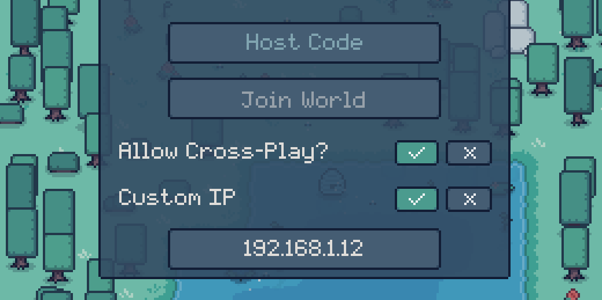
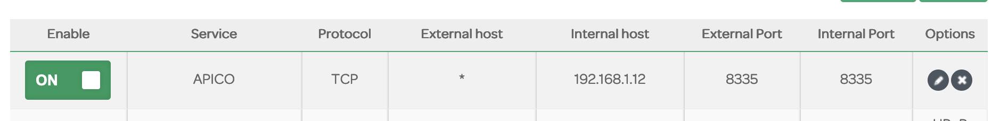

# BeeNet
This is an open-source multiplayer relay server built for my game, [APICO](https://store.steampowered.com/app/1390190?utm_source=tnpage).  
The code here is adapted from the default BeeNet server the game uses (with a few changes), and provides a simple version that players can run locally themselves for PC + Console.

The point of this is to allow players the ability to host a server themselves if something goes wrong with the main server, or if they don't want to use the main server due to it being a UK/LONDON server and all the region ping that may come with that. It also acts as some future proofing for the multiplayer functionality of APICO in case I can no longer afford to keep the main server running anymore.

This is a RELAY server. This means it is not an instance of the game but instead sends messages between a "host" game and any connected "client" games. As such there is no specific world file linked to the server, it's simply a way for your game and your friends game to communicate over the internet. Everyone who wants to play multiplayer together needs a copy of the game.

> Custom IP option is only available in APICO v4.0+

## Usage
For the easiest route, download the server for your OS from the [Releases](https://github.com/ellraiser/beenet/releases) section.

To start the server, simply run the program - you may run into firewall or security warnings which you will need to accept/ignore. Once running you'll see a window open:  

If the other player/s are on same network as the person running the server (i.e. you're all at the same house), this is the only setup needed.  

You all just need to enter the IP shown in the server as your "Custom IP" in-game, and then you can player multiplayer together as you would normally. 

If the other player/s are NOT playing on the same network as the person running the server, you will need to port forward, lucky you!

## Port Forwarding
Port forwarding is something you have to do in your internet router settings. If you do not have access to your router (i.e. you're in student accomadation) you will not be able to port forward and so you will not be able to run a custom BeeNet server for players not on the same network as you.

Assuming you do have access to your router, you can use the website, [Port Forward](https://portforward.com/router.htm) to find out specific steps for the brand of router you have.
Usually the steps involve something like going to the URL `192.168.1.1` in your browser, logging in using the username/password on the back of your physical router, and then specifying a port to forward.

The port you need to forward is `8335`!

Once you have that setup you need to find your public IP address, you can use [Whats My IP](https://www.whatismyip.com/) for this.  
> Note that depending on your ISP, your public IP may change each time you turn on your computer, so it might not always be the same - it's best to check each time using the link above.

When you have that, other players will be able to join the server by entering your public IP+PORT in the Custom IP in-game, i.e.:  
`78.188.10.32`  

> If you try and enter your own public IP address when you're running the BeeNet server on the same machine you're playing on you'll get a "Failed to connect to BeeNet" error - you need to use your LOCAL IP address as shown in the previous section.

## Example Setups
**Example 1**  
Beenjamin and their friend Beetrix want to play APICO together. They are both at Beenjamin's house, on the same network. Beenjamin wants to host their world, and Beetrix wants to join them.

- Step 1: Beenjamin downloads the BeeNet server from the [Releases](https://github.com/ellraiser/beenet/releases) section and runs the program
- Step 2: Beenjamin opens APICO, and enters the IP shown in the server as their Custom IP
- Step 3: Beenjamin clicks "Host Game" in APICO as they would normally and starts their world
- Step 4: Beenjamin sends Beetrix the IP shown in the server, who also sets this as their Custom IP in-game
- Step 5: Beetrix enters the host code from Beenjamin's game, and joins the world
- Step 6: They both spend a wonderful afternoon playing APICO!

**Example 2**  
Bobbee and their friend Barnabee want to play APICO together. Barnabee is currently over on the Mainland for a research trip, so is on a different network to Bobbee. Bobbee wants to host their world, and Barnabee wants to join them.

- Step 1: Bobbee downloads the BeeNet server from the [Releases](https://github.com/ellraiser/beenet/releases) section and runs the program
- Step 2: Bobbee goes to [Port Forward](https://portforward.com/router.htm) to find out how to forward the port `8335`
- Step 3: Bobbee goes to [Whats My IP](https://www.whatismyip.com/) and jots down their public IP address
- Step 4: Bobbee opens APICO, and enters the IP shown in the server as their Custom IP
- Step 5: Bobbee clicks "Host Game" in APICO as they would normally and starts their world
- Step 6: Bobbee sends Barnabee their public IP address, who sets this as their Custom IP in-game
- Step 7: Barnabee enters the host code from Bobbee's game, and joins the world
- Step 8: They both spend a wonderful evening playing APICO!

## Nerds Only
If ur a nerd and know what you're doing, or running Linux (same thing :P) you can just download the repo and run locally through the terminal - you just need nodejs installed.

There's a lot of differences between this server and the real BeeNet the game uses by default, I've stripped out a lot of stuff not needed so if something seems missing then it probably is! The game client itself handles all the sync actions, the server is just sending the data to the correct clients based on the host, so keep in mind there's a whole other side of the multiplayer you can't see. 

Unless you find something breaking with the actual sync functionality I'm prob not going to be accepting PRs on this one as there's already a lot for me to keep on top of :)
